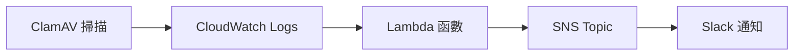

## 功能概述

這個 Lambda 函數主要用於處理 ClamAV 防毒軟體的掃描結果，並通過 SNS 發送通知到指定的主題。整個流程是由 CloudWatch 觸發的。

## 系統架構



## 主要組件

1. **CloudWatch Logs**

   - 日誌組名稱：`clamscan-log-group`
   - 收集 ClamAV 的掃描結果日誌

2. **Lambda 函數**

   - 運行環境：Python
   - 主要功能：解析日誌並提取掃描結果

3. **SNS Topic**
   - ARN：`arn:aws:sns:ap-northeast-1:471112694074:Notify_to_Slack`
   - 用於發送通知到 Slack

## 處理流程

1. **日誌解碼流程**

   - 接收 base64 編碼的 CloudWatch 日誌
   - 解壓縮 gzip 格式的數據
   - 解析 JSON 格式的日誌內容

2. **掃描結果分析**

   - 使用正則表達式提取感染文件數
   - 根據感染文件數判斷掃描狀態
   - 生成適當的狀態消息

3. **通知發送**
   - 格式化通知消息
   - 包含實例 ID 和掃描結果
   - 通過 SNS 發送到指定主題

## 消息格式

### 輸入日誌格式

```
----------- SCAN SUMMARY -----------
Known viruses: 8704421
Engine version: 0.103.12
Scanned directories: 1
Scanned files: 2
Infected files: 0
Data scanned: 0.00 MB
Data read: 0.00 MB (ratio 0.00:1)
Time: 31.887 sec (0 m 31 s)
Start Date: 2025:02:12 08:25:57
End Date:   2025:02:12 08:26:29
```

### 輸出消息格式

```
Instance ID: `[實例ID]`
✅ 掃描完成，未發現病毒。
```

或

```
Instance ID: `[實例ID]`
🦠 發現病毒！請立即處理。
```

## 錯誤處理

- 完整的異常捕獲和日誌記錄
- 返回適當的 HTTP 狀態碼
- 詳細的錯誤消息記錄

## 注意事項

1. 確保 Lambda 函數有適當的 IAM 權限：

   - CloudWatch Logs 讀取權限
   - SNS 發布權限

2. 建議設置監控：

   - Lambda 執行超時
   - 錯誤率監控
   - CloudWatch Logs 保留期限

3. 最佳實踐：
   - 定期更新 Python 依賴包
   - 監控 SNS 發送失敗情況
   - 保持日誌格式一致性

## 程式碼展示

```python=
import json
import boto3
import base64
import gzip
import logging
import re

sns_client = boto3.client('sns')
log_group_name = 'clamscan-log-group'
sns_topic_arn = 'arn:aws:sns:ap-northeast-1:000000000000:Notify_to_Slack'

logging.basicConfig(level=logging.INFO)
logger = logging.getLogger()

def get_scan_result(message):
    """從掃描日誌中提取感染文件數"""
    match = re.search(r"Infected files: (\d+)", message)
    if match:
        return int(match.group(1))
    return 0

def lambda_handler(event, context):
    try:
        logger.info("Original event: %s", json.dumps(event, indent=2))

        compressed_payload = base64.b64decode(event['awslogs']['data'])
        uncompressed_payload = gzip.decompress(compressed_payload)
        log_data = json.loads(uncompressed_payload)

        if 'logEvents' not in log_data:
            logger.error("No logEvents found in log_data")
            return {
                'statusCode': 400,
                'body': json.dumps('No log events found')
            }

        # 獲取所有日誌消息
        combined_messages = []
        latest_timestamp = 0
        for log_event in log_data['logEvents']:
            combined_messages.append(log_event['message'])
            latest_timestamp = max(latest_timestamp, log_event['timestamp'])

        # 將所有消息合併成一個字符串
        full_message = '\n'.join(combined_messages)

        # 檢查是否有病毒
        infected_files = get_scan_result(full_message)
        status_message = "✅ 掃描完成，未發現病毒。" if infected_files == 0 else "🦠 發現病毒！請立即處理。"

        # 創建格式化的消息
        formatted_message = (
            f"Instance ID : `{log_data.get('logStream', 'N/A')}`\n"
            f"{status_message}"
        )

        # 發送 SNS 通知
        sns_message = {
            "version": "1.0",
            "source": "custom",
            "content": {
                "description": formatted_message
            },
            'timestamp': latest_timestamp,
            'message': formatted_message
        }

        sns_client.publish(
            TopicArn=sns_topic_arn,
            Message=json.dumps(sns_message),
            Subject='ClamAV 掃描結果通知'
        )

    except Exception as e:
        logger.error(f"Error occurred: {str(e)}")
        return {
            'statusCode': 500,
            'body': json.dumps(f'Error processing log: {str(e)}')
        }

    return {
        'statusCode': 200,
        'body': json.dumps('Log processed successfully')
    }
```
